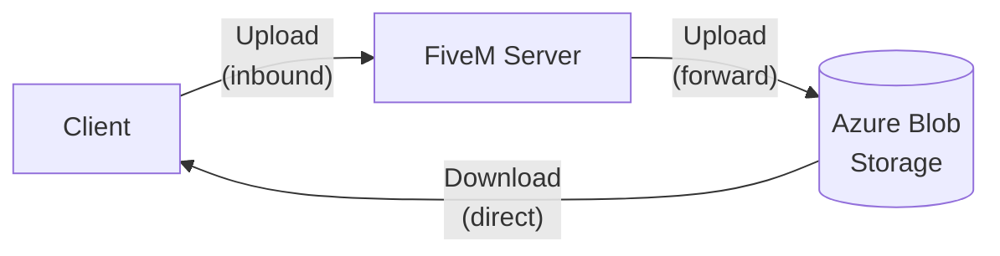

# lb-upload-azure-blob

A FiveM script that serves as an alternative to [lb-upload](https://github.com/lbphone/lb-upload), persisting media files to **Azure Blob Storage** instead of your game server.

**How traffic works:**
- **Downloads (read):** Clients fetch files directly from Azure Blob Storage — no traffic hits your server.
- **Uploads (write):** Files are uploaded through your server first, then stored in Azure Blob Storage.



> **Note:** This is not a drop-in replacement for Fivemanage or similar services. Due to current limitations in how lb-phone handles uploads, upload traffic still arrives at your server first before being forwarded to Azure Blob Storage.
> If you'd like to see native storage support added directly to lb-phone, consider upvoting [this feature request](https://discord.com/channels/1032005998895960135/1482163603657461870). If it gets implemented, this script would no longer be needed.

> **Migrating from lb-upload?** No file or data migration needed. Keep lb-upload as-is, add this resource alongside it, and downloads of your existing files should continue to work.

## Requirements
The Azure Storage Blob container requires public read access.
When creating the resource, refer to the following page and enable anonymous access at the account level:
[Configure anonymous read access for containers and blobs - Azure Storage | Microsoft Learn](https://learn.microsoft.com/en-us/azure/storage/blobs/anonymous-read-access-configure?tabs=portal)

If a container does not exist, it will be created automatically.
If you create the container in advance, set the container-level access permission to "Blob (anonymous read access)".

## Installation

1. Download the script and rename it from `lb-upload-azure-blob-master` to `lb-upload-azure-blob`
2. Place it in your resources folder
3. Add `ensure lb-upload-azure-blob` to your server.cfg
4. Configure `/lb-upload-azure-blob/config.lua`. The available options are as follows.

### Security Settings (`Config.Security`)

| Key | Type | Default | Description |
|---|---|---|---|
| `RequireConnected` | boolean | `false` | If `true`, only players connected to your server are allowed to upload media. |
| `ApiKey` | string / false | `"your_api_key"` | The API key required for uploading. Set to `false` to disable. |
| `RequireOrigin` | array / false | `false` | List of allowed origins (e.g. `"https://cfx-nui-lb-phone"`). Set to `false` to allow all origins. |

### Limit Settings (`Config.Limits`)

| Key | Type | Default | Description |
|---|---|---|---|
| `FileSize` | number | `50` | Maximum upload file size in MB. |
| `Mimes` | array / false | Various audio, video, and image types | List of allowed MIME types. Set to `false` to allow all file types. |

### Azure Blob Storage Settings (`Config.AzureStorage`)

| Key | Type | Description |
|---|---|---|
| `AccountName` | string | Azure Storage account name. |
| `AccountKey` | string | Azure Storage account key. |
| `ContainerName.Images` | string | Container name for image uploads. |
| `ContainerName.Videos` | string | Container name for video uploads. |
| `ContainerName.Audio` | string | Container name for audio uploads. |


## Use with [lb-phone](https://store.lbphone.com/)

> **Note:** This requires lb-phone v1.5.3 or later.

This script was primarily developed to be used with [lb-phone](https://store.lbphone.com/). Follow these steps to set it up with lb-phone:

1. Set `Config.UploadMethod` to `LBUpload` in `lb-phone/config/config.lua`.
```lua
    Config.UploadMethod.Video = "LBUpload"
    Config.UploadMethod.Image = "LBUpload"
    Config.UploadMethod.Audio = "LBUpload"
```
2. Add `windows.net` to `Config.UploadWhitelistedDomains` in `lb-phone/config/config.lua`.
```lua
    Config.UploadWhitelistedDomains = {
        -- other domains...
        "windows.net",
    }
```
3. Add your API keys to `API_KEYS` in `lb-phone/server/apiKeys.lua`.
```lua
    API_KEYS = {
        Video = "your_api_key",
        Image = "your_api_key",
        Audio = "your_api_key",
    }
```
4. Set `UploadMethods.LBUpload.Default.url` to `https://BASE_URL/lb-upload-azure-blob/` in `lb-phone/shared/upload.lua`.
```lua
    LBUpload = {
        Default = {
            url = "https://BASE_URL/lb-upload-azure-blob/",
            field = "file",
            headers = {
                ["Authorization"] = "API_KEY"
            },
            error = {
                path = "success",
                value = false
            },
            success = {
                path = "link"
            },
            sendPlayer = "metadata"
        },
    },
```

## Development

Make sure you have node.js and pnpm installed

1. Clone the repository
2. cd into lb-upload-azure-blob/server/backend
3. Run `pnpm install`
4. Run `pnpm watch` to start the server. Make sure to restart the script in FiveM after making changes.
